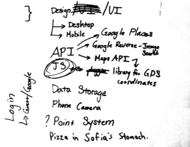

<h1>ScavengerTours</h1>
==============
<h3>Deployed now at <a href="http://ml7.stuycs.org:1995/">ml7.stuycs.org:1995</a></h3>

<ul>
  <li>Group Members: Sarah Babski, Claire Hripcsak, Denis Plotkin, Sofia Wyetzner</li>
  <li>Group Leader: Sofia Wyetzner*</li>

*We, as a commune, subscribe to the Marxist set of ideals and hence do not recongnize the concept of a "group leader". Sofia is simply the figure-head of our local government.

<h2>Used in this project:</h2>
<ul>
  <li>pymongo</li>
  <li>flask</li>
  <li>Google Maps Api</li>
  <li>HTML 5 Geocoding</li>
</ul>

 

<h3>Enjoy!</h3>

  <li>Tasks</li>
  
  <li>Task Leaders:</li>
  
  <ul>
    <li>Design/UI: Sarah Babski</li>
    <li>API Work: Denis Plotkin</li>
    <li>Javascript/Design: Sofia Wyetzner</li>
    <li>Data Storage: Claire Hripcsak</li>
  </ul>
  
  <li>What do we expect to have done by the first Friday?</li>
  
  <ul>
    <li> Research, figure out and plan out how to use the API's <strong> - done</strong>, can't use reverse google search but google maps is all good</li>
    <li> Basic templates for all webpages <strong> - done</strong>, basic files made for taking tours, not creating tours </li>
    <li> Decide what type of data storage suits our needs <strong> - done</strong>, we're going to use mongodb </li>
    <li> Design the webpage <strong> - done</strong>, designs are drawn out on paper</li>
    <li> Differentiate the mobile site from the desktop site <strong> - done</strong>, both will be used, mobile will be an app created by PhoneGap</li>
  </ul>

  <li> What do we expect to have done by the second Friday?</li>
  <ul>
    <li> Layout of site complete. </li>
    <li> Interface done, except for the utilization of API's </li>
    <li> General, coarse usage of site available </li>
    <li> Storage of data figured out </li>
  </ul>
  
</ul>

Things to add:
<ul>
<li>Readme look better</li>
<li>About page</li>
<li>Widths on create</li>
<li>Create a tour picture</li>
<li>Pictorial hints</li>
<li>Try to register twice</li>
<li>Review/rate(+points)</li>
<li>Point-hint system</li>
</ul>
MOBILE SITE
<ul>
<li>Replace footer with simple header</li>
<li>No create</li>
<li>Only current tour?</li>
<li>Margins</li>
<li>Font size</li>
</ul>

  

 
